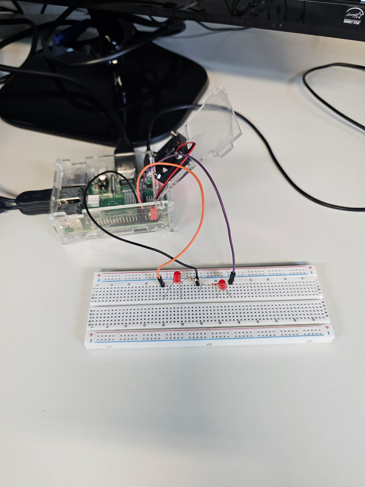

# Prática 5 
## Alunos:
Vitor Gabriel Saturnino de Melo nº:14611599

João Pedro Muto Cisotto nº:14761684
# Parte 1
Esta Prática tem como objetivo configurar um serviço systemd, para que scripts sejam rodados juntamente com a inicialização. Para isso, inicialmente foi desenvolvidos dois arquivos em Python, um para realizar o "blink" de um led no GPIO18 e posteriormente um que iria fazer que o led que estava realizando o "blink" fosse desligado e outro led, conectado no GPIO17 fosse ligado. Sendo os arquivos resposáveis por tais execuções: **[blinkled_rpigpio.py](https://github.com/vitormelo260/Pratica5_embarcados/blob/main/blinkled_rpigpio.py)** e blink_stop_led.py, respectivamente, estando eles disponibilizados no repositório do github.

Para que fosse possível a realização de testes, foi realizado o circuito apresentado na figura abaixo:

Os arquivos .service são "Unit Files", ou seja, são arquivos de configuração utilizados para descrever ao systemd como um arquivo deve ser gerenciado. Tendo isso em mente, foi desenvolvido um arquivo .service para que fosse configurada a inicialização dos arquivos realizados em Python juntamente com a inicialização do sistema com o todo, sendo esse o arquivo led_blink.service. Nesse arquivo, foi utilizado o comando ExecStart para inicializar o arquivo blinkled_rpigpio.py juntamente com o sistema operacional e o comando ExecStop para quando fosse pausado o serviço o código blink_stop_led.py fosse ativado.

# Parte 2 
Para a parte 2, foi iniciada a prática com o git e o GitHub, para que fosse desenvolvida a capacidade de gerenciar alterações nos códigos e permitir a colaboração em projetos. Para isso, foram utilizados os comados:

git clone: Para criar uma cópia local do repositório remoto.

git add .: Para preparar todos os arquivos modificados para o commit.

git commit - "":Para registrar as alterações e nomear.

git push: Para enviar as alterações do repositório local ao GitHub.

git log: Para registrar o histórico de commits.

Além disso, como requisito da prática foi gerado o arquivo de histórico de comandosgit utilizados, sendo ele representado pelo historico_git.txt. 

